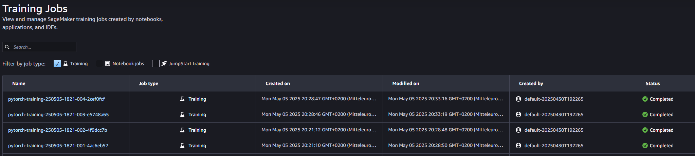

# Image Classification using AWS SageMaker

This Readme gives an overview how to use AWS Sagemaker to train a pretrained model that can perform image classification by using the Sagemaker profiling, debugger, hyperparameter tuning and other good ML engineering practices. 

## Dataset
The provided dataset is the dogbreed classification dataset which can be found in the classroom.

### Access
Data was uploaded to an S3 bucket such that sagemaker can access it during training.

## Hyperparameter Tuning
What kind of model did you choose for this experiment and why? Give an overview of the types of parameters and their ranges used for the hyperparameter search

I chose a Resnet18 model, as it is a "standard" CNN architecture for image classification problems. Furthermore it fits on smaller GPUs and is trainable fast.
For hyperparamter tuning I selected the learning rate and the batch size as sample parameters, as they have an influence on classification performance. 
Other hyperparameters such as the model architecture or image augmentation modes would also be possible.
Hyperparameter tuning was done using the validation dataset only.

Remember that your README should:
- Include a screenshot of completed training jobs



- Logs metrics during the training process --> see notebook
- Tune at least two hyperparameters --> **batch size**, **learning rate**
- Retrieve the best best hyperparameters from all your training jobs --> batch size:**32**, learning rate: **0.003**

## Debugging and Profiling
**TODO**: Give an overview of how you performed model debugging and profiling in Sagemaker

I defined several profiling rules (decreasing loss, vanishing gradient, etc.) in order to detect abnormal behaviour.
For debugging I added debug hooks in order to save the tensors in regular intervals.

### Results
**TODO**: What are the results/insights did you get by profiling/debugging your model?

The model training itself looks reasonable, as the loss decreases continuously when training for several epochs.
The rules triggered (batch size, low GPU usage) indicate that training with a larger batch size would make sense.
Nevertheless, hyperparamter tuning showed that training with a smaller batch size gives better model accuracy.

**TODO** Remember to provide the profiler html/pdf file in your submission.
[here](ProfilerReport/profiler-output/profiler-report.html)

## Model Deployment
**TODO**: Give an overview of the deployed model and instructions on how to query the endpoint with a sample input.

I used an additional script [inference.py](inference.py) in order to deploy the model.
This script defines the model architecture and a function for loading the model weights.
For doing inference you have to pass a preprocessed and normalized image as a numpy array with 4 dimensions (batch size,width,height,channel)
The resulting class is the maximizing index (argmax) of the returned predictions.
```
from PIL import Image
# TODO: Your code to load and preprocess image to send to endpoint for prediction
image = Image.open("dogImages/test/001.Affenpinscher/Affenpinscher_00003.jpg")
import torchvision.transforms as transforms
transform_comp_test = transforms.Compose([
    transforms.Resize(256),
    transforms.CenterCrop(224),
    transforms.ToTensor(),
    transforms.Normalize((0.5, 0.5, 0.5), (0.5, 0.5, 0.5))
])
transformed_image = transform_comp_test(image)
transformed_image = transformed_image.unsqueeze(0)
transformed_image_numpy = transformed_image.numpy()
response = predictor.predict(transformed_image_numpy)
predicted_class = np.argmax(response)+1
```

**TODO** Remember to provide a screenshot of the deployed active endpoint in Sagemaker.


## Standout Suggestions
**TODO (Optional):** This is where you can provide information about any standout suggestions that you have attempted.
